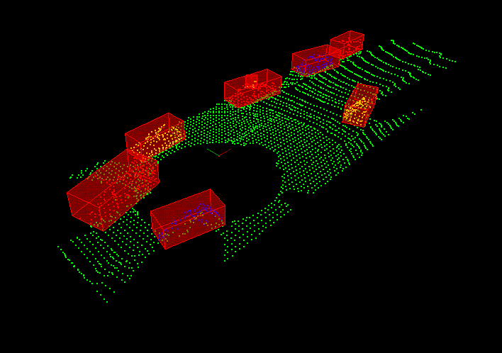

# Sensor Fusion

---

    
*  Process raw lidar data with filtering, segmentation, and clustering to detect other vehicles on the road.

*  Fuse camera images together with lidar point cloud data. Extract object features, classify objects, and project the camera image into three dimensions to fuse with lidar data. 

*  Analyze radar signatures to detect and track objects. Calculate velocity and orientation by correcting for radial velocity distortions, noise, and occlusions.

*  Fuse data from multiple sources using Unscented Kalman filters, and build extended and unscented Kalman filters for tracking nonlinear movement. 

---

### Lidar Obstacle Detection
<table><tr>
<td>
<figure>
    
    
Lidar Obstcle Detection

</figure></td>

<td><figure>
    
    
Lidar Obstcle Detection

</figure>
  </td>  </tr></table>

---
---

### 2D Feature Matching

<figure>
    
    
2D_Features

