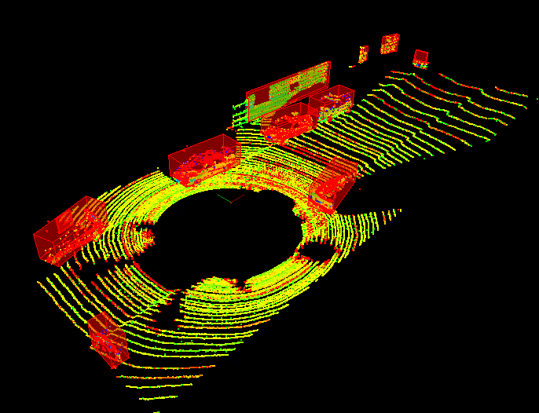

# Sensor Fusion

    
*  Process raw lidar data with filtering, segmentation, and clustering to detect other vehicles on the road. 

*  Fuse camera images together with lidar point cloud data. You'll extract object features, classify objects, and project the camera image into three dimensions to fuse with lidar data. 

* Analyze radar signatures to detect and track objects. Calculate velocity and orientation by correcting for radial velocity distortions, noise, and occlusions. 

* Fuse data from multiple sources using Kalman filters, and build extended and unscented Kalman filters for tracking nonlinear movement. 

---

## Projects

### [1. Lidar Obstcle Detection](https://github.com/darrickz/Sensor_Fusion/tree/master/SFND_Lidar_Obstacle_Detection)
* Implemented RANSAC algorithm to separated ground plane from obstacles
* Euclidean clustering algorithm is used to identify obstacles. KD tree implemented from scratch is used to speed up searching point cloud
<table><tr>
<td>
<figure>
    
    
Lidar Obstcle Detection

</figure></td>

<td><figure>
    
    
Tracking a bicyclist riding in front of the car

</figure>
  </td>  
  </td>
</tr></table>
<figure>
    <kbd>
    
   </kbd>        
    
Tracking a bicyclist riding in front of the car

</figure>

---

### [2. 2D Feature Tracking](https://github.com/darrickz/Sensor_Fusion/tree/master/SFND_2D_Feature_Tracking)
Various combination of keypoint detectors, descriptors and matching schemes are explored. 
<figure>
    <kbd>
    
    </kbd>    
    
2D_Features

</figure>

---

### [3. 3D Object Tracking and TTC calculation](https://github.com/darrickz/Sensor_Fusion/tree/master/SFND_3D_Object_Tracking)
* Various combination of keypoint detectors, descriptors and matching schemes are explored. 
* Object detection using the pre-trained YOLO deep-learning framework
* Methods to track objects by matching keypoints and bounding boxes across successive images
* Associating regions in a camera image with lidar points in 3D space
<figure>
    <kbd>
    
    </kbd>    
    
TTC Calculation

</figure>    
